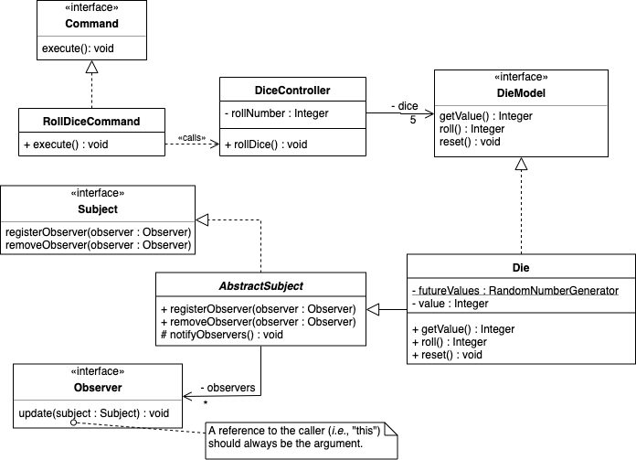
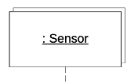

# Sequence Diagram

Due: June 16, 2020 at 11:00am

## Overview

In this assignment you will prepare a simple sequence diagram.

## Objectives

Students will:

-   Prepare a sequence diagram
-   Practice solution modeling under guidance
-   Demonstrate UML notation to show inter-object messaging

## Instructions

This assignment is to be completed individually; **no collaboration is
permitted**.

You may draw the diagram using a tool, or you may hand-draw it. *You may
**not** use a tool that generates UML diagrams from programming language code.*
If we see hallmarks of auto-generated UML, we will ask you to show us the tool
you used to prepare the diagrams. If you used a tool that auto-generates UML,
you will receive a score of 0 for this assignment.

### Setup

1.  You will use your `csce361-homework` repository for this assignment.
1.  You will need one of:
    -   A tool with which to draw UML diagrams, such as <https://draw.io>, that
        will let you save your diagram as a pdf file.
    -   A way to scan a hand-drawn diagram and save it as a pdf file. (If you
        hand-draw the diagram, you may wish to prepare the diagram with a
        pencil so you can make erasures.)

### Assignment

Your work on Procrastination Pastimes's Yatzy game has progressed; you are now
working on the design and have decided to prepare a couple of design-level UML
diagrams to explain what happens when the player wants to roll the dice. Here
is the class diagram:

There are some changes you'll notice in the class diagram from the previous
assignment:

-   Because we're transitioning from a domain model to a design model, we
    are now including visibility modifiers and datatypes.
<!--
    -   In some of the classes, we've included `«get/set»` stereotypes. This is
        non-standard UML that we're using as a shorthand to indicate whether
        there are public getters and/or setters for an attribute.
-->
-   We've added some attributes and operations and removed others.

    -   An underlined element, such as `futureValues` in `Die`,
        indicates that the element is a static field or method.

-   We've added classes that have no domain analogue.

    -   The `Subject` and `Observer` interfaces, and the `AbstractSubject`
        class are part of a variation on the Observer Pattern (see Sommerville,
        *Software Engineering* §7.2).

    -   There is a runtime dependency: `RollDiceCommand` will call a method in
        `DiceController` but doesn't maintain a reference. (For now you can
        assume it gets the temporary reference by magic.)

-   We've removed some classes. While this will often happen because certain
    domain classes are unnecessary in the design, in this case it is because
    the scoring categories are extraneous to the object interactions that occur
    when rolling dice.

Prepare a design-level sequence diagram that shows the process of rolling the
dice and making other parts of the system aware of the dice' new values.

**Throughout this diagram, to the extent possible, keep it consistent with the
provided class diagram.**

Show:

1.  A `RollDiceCommand` object named `rollDiceCommand` receives a "found
    message" that invokes the `execute()` method. Alternatively, you may show
    an actor named `Player` sending an `execute()` message to `rollDiceCommand`.

    -   The "found message" is more correct, but using the actor communicates
        that the `execute()` call is the result of something the player did.

1.  The `execute()` method calls the `rollDice()` method on an anonymous
    `DiceController` object.

    The player is limited to three rolls before they must score the dice.
    Because the scenario we're looking at is what happens when the dice are
    rolled, we will omit the interactions that occur if `rollDice()` is called
    after there have been three rolls.

1.  Create at `alt` frame with the guard `[rollNumber < 3]`. We will not
    include the `[else]` compartment.

    -   UML provides an `opt` frame for the situation in which you have an `if`
        without an `else`. You may use an `opt` frame if you wish, but since
        there *is* an `else` (but we are not showing it here), I'd go with an
        `alt`.

    When the roll number is less than 3, the `rollDice()` method will call
    `roll()` on each of the 5 `DieModel` objects.

1.  Create a `loop` frame. UML doesn't have a formal, clean way to show a "for
    each" loop, but the common convention is to use the guard `[for each ...]`
    where "..." is the name of whatever you're going to iterate over.

    -   The formal way to do this in UML is to use a "selector" variable (say,
        `i`) and use the guard `[0≤i<5]`. This works because we know how many
        `DieModel` objects are in `:DiceController.dice`. You may use either
        approach.

    If you look at the class diagram, `DiceController` "knows" about the
    `DieModel` interface, but doesn't know about the `Die` class. If we were
    focused on what `:DiceController` does then we would depict `DieModel`
    objects in the sequence diagram. Since we want to see how other objects
    learn about the new dice values, we will explicitly show in the sequence
    diagram that `:DiceController.dice` holds `Die` objects.

1.  Place a `Die` object in the sequence diagram. You have three options:

    1.  Place an anonymous `Die` object at the top with the other objects, with
        its lifeline stretching the full height of the sequence diagram. Show
        that there are multiple objects that this lifeline represents by
        creating the appearance of a pile of objects, like this:
        

    1.  Place a single anonymous `Die` object inside the `loop` frame, and have
        its lifeline extend no farther than the end of the `loop` frame.
        Without any annotations showing creation or destruction, all this
        indicates is that we are discussing only one `Die` object per iteration
        and it may be a different `Die` object in other iterations.

    1.  If you are using a selector, then use either of the previous options,
        but name the `Die` object `dice[i]` (assuming the selector is `i`).

1.  Inside the `loop` frame, show that `:DiceController.rollDice()` calls the
    `roll()` method on the `Die` object.

1.  Show that, as part of the `roll()` method, the `Die` object makes a self-
    call to `notifyObservers()`.

1.  Using appropriate UML notation, show that the `notifyObservers()` method
    will call the `update()` method on each of the `Die` object's observers. Be
    sure to include the appropriate argument.

1.  Show that, when the `roll()` method is finished, it returns `value` to its
    caller.

1.  The `rollDice()` method does not return anything, so you may omit a return
    arrow, but it is just as correct to show an unlabeled return arrow from
    `rollDice()`'s activation frame to its caller

1.  Similarly, the `execute()` method does not return anything.

Be sure to note any assumptions you're making.

Reflect on any design shortfalls you found. What is unspecified? What is
underspecified? Are there any misplaced responsibilities? You do not need to
report your thoughts as part of *this* assignment, but you should give it
thought for a *future* assignment.

After you have completed your diagram, save it as a pdf file called
`05-sequence_diagram.pdf` in your local copy of your `csce361-homework`
repository.  Then upload (add/commit/push) to the server.

### Deliverables

For grading, we will pull updates to your `csce361-homework` repository after
the assignment is due, and we will look for:

-   `05-sequence_diagram.pdf` containing your sequence diagram.

*It is your responsibility to ensure that your work is in the master branch of
the **correct repository** and that we have the correct level of access to the
repository at the **time the assignment is due**.  We will grade what we can
retrieve from the repository at the time it is due.  Any work that is not in
the correct repository, or that we cannot access, will not be graded.*

## Rubric

The assignment is worth **13 points**:

-   **1.0 points** for including the `RollDiceCommand` object.
    -   0.5 for including the object
    -   0.5 for correctly showing that it is named `rollDiceCommand`

-   **1.0 points** for including the `DiceController` object.
    -   0.5 for including the object
    -   0.5 for correctly showing that it has no specified name for this
        interaction

-   **1.0 points** for correct lifelines and activation frames.

-   **1.0 points** for the `execute()` and `rollDice()` messages (0.5 each).

-   **1.0 points** for the `alt` (or `opt`) frame.
    -   0.5 for correctly showing the frame
    -   0.5 for correctly showing the guard

-   **1.0 points** for the `loop` frame.
    -   0.5 for correctly showing the frame
    -   0.5 for correctly showing the guard

-   **1.0 points** for the `Die` objects.
    -   0.5 for correctly showing that there are multiple such objects
    -   0.5 for naming the objects or leaving them anonymous in a fashion
        consistent with the loop

-   **0.5 points** for the `roll()` message.

-   **1.0 points** for the `notifyObservers()` message.
    -   0.5 for correctly showing the self-call
    -   0.5 for correctly showing the self-call's activation bar

-   **2.0 points** for showing the observers being notified of the update.

-   **0.5 points** for correctly showing that `roll()` returns `value` to its
    caller.

-   **0.5 points** for not including other objects

-   **0.5 points** for not including anything else wrong (TA discretion).

-   **1.0 point** for using a meaningful commit message when committing your
    file.

*If **at any time** your repository is public or has internal visibility then
you will receive a 10% penalty. Further, if another student accesses your
non-private repository and copies your solution then I will assume that you are
complicit in their academic dishonesty.*
