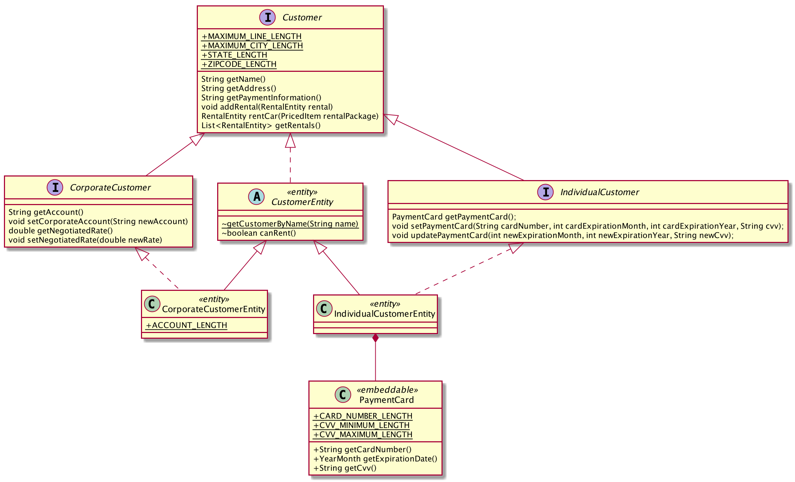
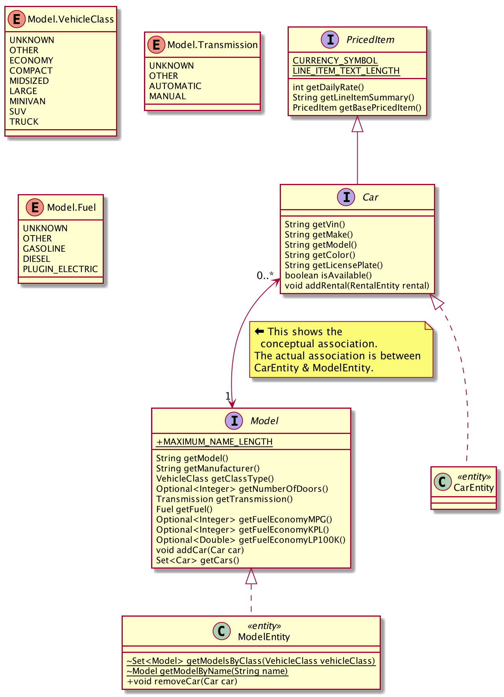
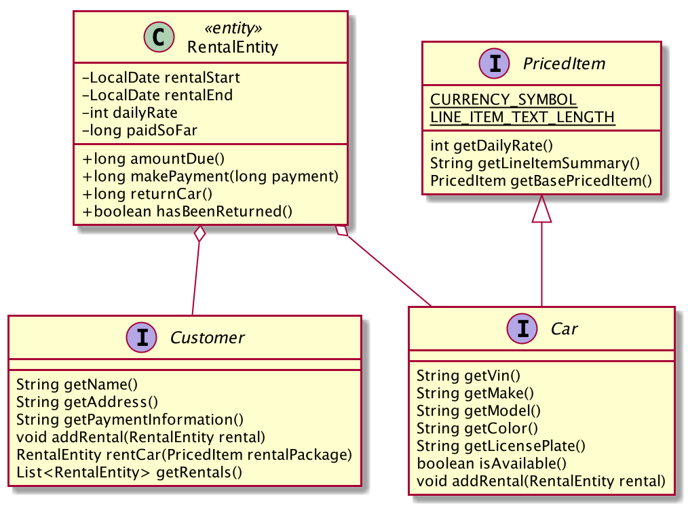

# Car Rental System

-   Assignment Due: July 27, 2020 at 11:00am CDT (UTC-5)
-   Peer Assessment Due: July 27, 2020 at 11:59pm (UTC-5)

In this assignment you will implement a simple car rental system. Most of the
functional requirements come from user stories prepared by students.

## Objectives

Students will:

-   Gain additional experience developing software with a partner
    -   Gain experience using branches on a version control system
-   Demonstrate good software engineering practices
-   Learn three design patterns
    -   Builder Pattern
    -   Decorator Pattern
    -   Façade Pattern
-   Learn the Three-Tier architectural style

## Instructions

This assignment is to be completed in assigned pairs; **no collaboration
other than with your assigned partner is permitted**.  One of the purposes of
pair-assignments is to practice teamwork. After completing the assignment you
will need to complete a peer assessment. Your contribution grade will be based
on the peer assessments and on the git history.

*Commit material that you worked on individually under your own name* using the
defaults that you set. *When (and only when) you commit material that was
developed using pair programming, override the default commit author to reflect
both authors* so that we can properly credit both authors for their contribution
grades. When you override the default commit author list both students' names,
and for the email address use a fake email address that is unique to the pair
of students by concatenating your Canvas login IDs (the angle brackets around
the email address are required):
```
git commit --author="Herbie Husker and Lil Red <hhusker20lred19@dev.null>"
```
You can use this same technique for the rare circumstance in which your partner
is briefly unable to commit code themselves:
```
git commit --author="Herbie Husker <herbie@huskers.unl.edu>"
```

##  Setup

1.  You and your partner will work on a shared repository, which has been
    prepared for you.

    1.  Navigate to your shared directory
        (<https://git.unl.edu/csce_361/summer2020/30pairNN/>, where *NN* is your
        team number).

    1.  Verify that the repository is private, and that you and your partner
        both have Maintainer access.

1.  Both students should:

    1.  Clone the project: `git clone <URL>` (here the angle brackets should
        not be included).

        -   **Do *NOT* place your car rental system repository inside your
            csce361-homework repository!**

    1.  Import the project into your IDE. The project is set up as a Maven
        project, so you can follow your IDE's instructions to import a Maven
        project.

1.  Prepare the database.

    -   ***You and your partner can share a database in this assignment.***
        Decide whose MySQL account you will use and provide the MySQL password
        with the other partner.

        -   Do *not* share your cse.unl.edu password!

        -   After the assignment is over, change your MySQL password

    1.  In the `src/main.resources` directory, copy
        `hibernate.cfg.xml-TEMPLATE` to `hibernate.cfg.xml` and replace
        USERNAME and MYSQL_PASSWORD with the username and MySQL password that
        you decided to use for the assignment, the same as you did in the
        database setup assignment.

    1.  Run `edu.unl.cse.csce361.car_rental.backend.DatabasePopulator` to fill
        the database with starter data.

##  Assignment

Lily Redd, the owner of Husker Klunker Car Rental Company, seeks your help.
The company previously used notecards to keep track of its inventory and a
pocket calculator to prepare customers' bills. After a particularly unfortunate
incident involving the notecards, a table fan, a jar of peanut butter, and the
owner's cat, you've been tasked with automating the car rental process.

You and your partner will implement the car rental system with limited
functionality.

### Architecture

The system shall have a layered architecture; specifically, a three-tier
architecture.  These shall be opaque layers.  See *Software Engineering*
§6.3.1, and *Engineering Software Products*, pp96-99.

### Design Patterns

-   Use the *Builder Pattern* to create cars, models, and customers that have
    some fields with default values and other fields with non-default values.
    -   HFDP, [a brief discussion in the "Leftover Patterns" appendix](https://learning.oreilly.com/library/view/head-first-design/0596007124/apa.html#builder)
    -   See discussion below on using the Builder pattern to implement default
        constructor arguments.
-   Use the *Decorator Pattern* to create represent the package that a customer
    is renting.
    -   HFDP, [Chapter 3](https://learning.oreilly.com/library/view/head-first-design/0596007124/ch03.html)
-   Use the *Façade Pattern* to hide the internal details of the logic layer
    and the backend. The façade objects should not do any work; they should
    delegate to objects within their corresponding subsystems.
    -   HFDP, [second half of Chapter 7](https://learning.oreilly.com/library/view/head-first-design/0596007124/ch07.html#home_sweet_home_theater)

#### Default Constructor Arguments

The Builder Pattern, as discussed in *Head First Design Patterns*, is a great
way to create some complex objects. It's also useful to overcome Java's lack of
default constructor arguments. Suppose you have a `Foo` class with two fields,
`int one` and `double two`. Suppose also that we want `one` to have a default
value of `1`, and `two` to have a default value of `2.0`. In a language that
has default arguments, we could implement this with a single constructor, such
as:
```
def __init__(self, one=1, two=2.0):
    self.one = one
    self.two = two
```
Java doesn't have default arguments, so we might try this:
```
public Foo() { this(1, 2.0); } // calls another constructor using default values
public Foo(int one) { this(one, 2.0); }
public Foo(double two) { this(1, two); }
public Foo(int one, double two) { this.one = one; this.two = two; }
```
Now suppose that instead of two fields, there are three. Or four. The number of
combinations grows exponentially. *If* you can make it work. In the example,
`one` and `two` are different types. Suppose that `two` is an `int` instead of
a `double`. The compiler won't let you create two constructors with the exact
same signature in the same class:
```
public Foo(int one) { this(one, 2); }   // even if the compiler allowed this,
public Foo(int two) { this(1, two); }   // which is called for "Foo(5)"?
```
The solution is to create a builder class. I concur with the *Head First Design
Patterns* authors that Foo should be an interface (or an abstract class with
mostly abstract methods). The builder class is then free to select the best Foo
implementation based on the situation.
```
public class FooBuilder {
private int one;
private int two;

public FooBuilder() {
    this.one = 1;
    this.two = 2;
}

    public FooBuilder setOne(int one) {
        this.one = one;
        return this;
    }

    public FooBuilder setTwo(int two) {
        this.two = two;
        return this;
    }

    public Foo build() {
        return new ConcreteFoo(this.one, this.two);
    }

    /** The Foo implementation doesn't have to be an inner class,
        but it could be */
    private class ConcreteFoo {
        ConcreteFoo(int one, int two) {...}
        ...
    }
}
```
Now the `Foo` class needs only a single constructor, one that takes *all* of
the arguments. By calling a `setXX()` method, we override the default value; by
not calling it, we accept the default value, such as:
```
Foo foo1 = new FooBuilder().build();            // uses default values
Foo foo2 = new FooBuilder().setOne(5).build();  // overrides default "one"
Foo foo3 = new FooBuilder().setTwo(9).build();  // overrides default "two"
Foo foo4 = new FooBuilder().setOne(7).setTwo(12).build(); // overrides both
```

Our toy example here doesn't really illuminate the full value of separating the
interface from the implementation, but you should do so if only to make sure
that the client code cannot depend on a particular `Foo` implementation
(remember the Dependency Inversion Principle: depend on abstractions, not
concretions), which will make your code more maintainable. Doing so will also
get you in the habit for the eventuality that you do find it useful to be able
to have your code select from many possible implementations based on the
situation.

### Starter Code

-   The directory structure is prepared for a three-tier architecture. Place
    the code for the frontend subsystem in the
    `src/main/java/edu/unl/cse/csce361/car_rental/frontend/`
    directory, the code for the logic layer in the
    `src/main/java/edu/unl/cse/csce361/car_rental/rental_logic/` directory,
    and the code for the backend in the
    `src/main/java/edu/unl/cse/csce361/car_rental/backend/` directory.
-   *src/main/java/.../backend/* directory
    -   Review the JavaDoc if you're unclear what a method or constant is used
        for. The JavaDoc is provided where a public method (or constant) is
        declared and is not repeated in the classes where it's implemented or
        overridden. Generally, only public methods (and constants) have
        JavaDoc; however, there are a few package-visible methods that have
        JavaDoc.
    -   `DatabasePopulator.java` -- this is a simple command-line program whose
        sole purpose is to populate your database with starter data. You should
        run this program after you've placed the database information in
        `hibernate.cfg.xml` and again any time that you drop your tables.
        -   The methods in this class use the Entity classes' constructors. For
            your production code, you will write Builder classes and use those
            to create new cars, models, and customers.
        -   If you add fields to the Entity classes, you may need to update
            `DatabasePopulator.java` to place values in those fields.
    -   `Backend.java` -- this is an incomplete façade class for the
        Backend subsystem
    -   `HibernateUtil.java` -- this is a utility class to use with Hibernate
        (see notes on Hibernate, below)
    -   The customer inheritance hierarchy
        
        -   `Customer.java` is the principal interface; your code should rely
            on this unless there is a reason to be more specific
        -   `CorporateCustomer.java` and `IndividualCustomer.java` are the
            interfaces for corporate customers and individual customers,
            respectively
        -   `CustomerEntity.java`, `CorporateCustomerEntity.java`, and
            `IndividualCustomerEntity.java` are the implementations of their
            respective interfaces. They use Hibernate to persist their data.
    -   The car/model inheritance hierarchy
        
        -   `Car.java` represents cars that can be rented, and `Model.java`
            represents car models. That is, "Canyonero" is a car model, and
            there are several cars that are Canyoneros.
        -   `CarEntity.java` and `ModelEntity.java` are the implementations of
            their respective interfaces. They use Hibernate to persist their
            data.
    -   `RentalEntity.java`
        
        Each time a customer rents a car, a `RentalEntity` is created to store
        the data for that rental: which customer, which car, the begin and end
        dates, the daily rate, and the amount of Zorkmids paid so far.
        -   `RentalEntity` objects are created by the `Customer.rentCar()`
            method.
    -   `PricedItem` is the interface you will use for the Decorator Pattern.
        With the exception of `CarEntity`, all `PricedItem` objects will be
        wrappers around other `PricedItem` objects.
-   *src/main/java/.../frontend/*  and *src/main/resources/.../frontend/*
    directories
    -   Contain starter code for the GUI; this is the same starter code that
        was provided for the GUI prototype assignment
-   *src/main/resources* directory
    -   `hibernate.cfg.xml-TEMPLATE` is the file you will copy to
        `hibernate.cfg.xml`.
        -   In `hibernate.cfg.xml` (*not* in the template), replace USERNAME
            and MYSQL_PASSWORD with the username and MySQL password that you
            and your partner decide to use for the assignment.
        -   If you create new Entity classes, you will need to update
            `hibernate.cfg.xml-TEMPLATE` (and `hibernate.cfg.xml`) to reflect
            this.
-   *src/test/* directory
    -   The *src/test/resources/* directory has `hibernate.cfg.xml` for the
        in-memory test database.
        -   If you create new Entity classes, you will need to update
            `hibernate.cfg.xml` to reflect this.
    -   The *src/test/java/.../backend/* directory has two files.
        -   `DatabaseTest.java` tests the database-related code
        -   `BackendTest.java` tests the backend façade. As it is, some of the
            tests in `BackendTest.java` will only pass if the database code
            passes. Feel free to refactor for testability if you like.

#### Notes on Hibernate

In addition to the tutorials already provided, you may find the JavaDoc for
Hibernate and for the Java Persistence API useful:

-   [Hibernate 5.4 JavaDoc](https://docs.jboss.org/hibernate/orm/5.4/javadocs/)
-   [Persistence API 2.2 JavaDoc](https://docs.jboss.org/hibernate/jpa/2.2/api/index.html?javax/persistence/package-summary.html)

The general pattern for most accesses to the database take the form
```
session = HibernateUtil.getSession();
session.beginTransaction();
... // possibly changes
... // CRUD
session.getTransaction().commit();
```

-   Create: `session.saveOrUpdate(persistentObject)`
-   Retrieve:
    -   If you have the primary key:
        `persistentObject = session.load(PersistentClass.class, primaryKey)`
    -   If you have the "natural key" (a unique, immutable field that the class
        actually uses that isn't the primary key due to performance
        considerations):
        `session.bySimpleNaturalId(Persistent.class).load(name);`
        -   See `CustomerEntity.getCustomerByName()` as an example
        -   If the natural key is a compound key, see
            [this guide](https://docs.jboss.org/hibernate/orm/5.0/mappingGuide/en-US/html/ch07.html)
            for further discussion and examples
-   Update: `session.saveOrUpdate(persistentObject)`
-   Delete: `session.remove(persistentObject)`
    -   I do not foresee you needing to delete any persistent objects in this
        assignment

If you don't know the primary key or the natural key, retrievals can also be
accomplished using Hibernate Query Language. The single-argument
`Session.createQuery(String)` will produce unchecked casting warnings, so you
will likely prefer the two-argument `Session.createQuery(String,Class)`, in
which you specify the class (or interface) that the returned objects should be
cast to. See `ModelEntity.getModelsByClass()` as an example.

Any new fields that you need to add to an Entity class need to be annotated
with `@Column` if you want them to be persisted.

If you catch an exception that is thrown before `commit()` completes, call
```
session.getTransaction.rollback();
```
to undo the changes that you were attempting to commit.

## Issue Tracker

-   Create at least one Git Issue for each user story. You will probably create
    more than one Issue for each story.

-   Create Issues for other tasks as you deem appropriate.

-   Use the Issue assignment to coordinate your & your partner's work.

-   When committing code, include a reference to the Issue(s) the code is for
    using the hashtag-number notation.

-   Close an Issue for subtasks as appropriate.  Close an Issue for a whole
    user story only after the code passes the story's acceptance criteria.

-   You may, of course, create additional Issues when you discover their need.

### Branches

In addition to the master branch, you must have at least two development
branches and an integration/staging branch. Even though the usage should make
it clear which branch is the integration/staging branch, please give it a name
that makes it clear which branch is the integration/staging branch. Give the
development branches names appropriate to their specific purpose.

-   You may choose whether to have one development branch per student, per
    feature, or per issue; or you may devise another scheme to organize your
    development branches.
-   Make original commits *only* to a development branch.
-   When you are ready to integrate your changes:
    -   Merge the integration/staging brach into your development branch
        -   `git merge staging` (assuming `staging` is the name of your
            integration/staging branch).
    -   Resolve any merge conflicts.
    -   Make sure your code still compiles, runs, and passes all of its tests.
    -   Double-check that while you resolved merge conflicts and verified that  
        your code remains unbroken, your partner didn't add anything to the
        integration/staging branch.
        -   `git diff staging` should show differences only in one direction.
        -   If there are differences in both directions, merge the integration/
            staging branch into your development branch again.
    -   Once your development branch is strictly ahead of the integration/
        staging branch, merge your development branch into the integration/
        staging branch.
        -   ```
            git checkout staging
            git merge your_development_branch
            ```
        -   There shouldn't be any merge conflicts (they should have all been
            resolved on your development branch), but resolve them if there are.
        -   Make sure your code still compiles, runs, and passes all of its
            tests. Because you already did this on your development branch,
            there shouldn't be any problems -- but better safe than sorry.
        -   Return to your development branch to continue your work.
            -   `git checkout your_development_branch`
-   When and only when both you and your partner agree it's safe to copy the
    integration/staging branch to the master branch, do so:
    -   ```
        git checkout master
        git merge staging
        ```

When we grade your use of branches, we can use metadata from the commits: each
commit knows what branch it was created in and which branches it's currently a
part of, and also which commit(s) is its parent(s) (a regular commit has a
single predecessor; a merge commit has two, from which we can determine which
branches were merged). Nonetheless, please do *not* delete any branches after
merging them -- if we can visually determine from the commit graph that you
used branches as required then we won't need to examine the metadata.

### Functional Requirements

-   The unit of currency is the Zorkmid, denoted with the Unicode currency sign
    `¤`.

-   Husker Klunker charges the customer based on the *class* of the vehicle.
    For example, it costs more to rent an SUV than a mid-sized car, and an
    economy car costs less to rent than a compact car.

-   A customer may be an *individual customer* who will pay using their own
    credit card, or they may be a *corporate customer* who will pay using a
    corporate account.
    -   Individual customers always pay the list price of the vehicle class
        they are renting. An individual customer can only rent one car at a
        time.
    -   Corporate customers have a negotiated rate, which is a
        multiplicative factor. For example, if an SUV rents for ¤5000/day
        and the negotiated rate is 90% then the customer would only need to
        pay 0.9 × ¤5000 = ¤4500. A corporate customer can be renting several
        cars at the same time.

-   The total cost of a rental, for each day, is vehicle's daily rate, any
    "add-on"s such as satellite radio or insurance, and any applicable taxes &
    fees.
    -   The first day's rental will be charged when a customer rents a
        vehicle, and the remaining days' rental will be charged when they
        return the vehicle.

-   **NOTE**: unlike the wireframe, GUI prototype, and user stories
    assignments, the car rental system in this assignment is *not* reservation-
    based. Instead, the customer will select the vehicle on the day the rental
    starts, and the duration will be unknown until the customer returns the
    vehicle.
    -   This should simplify some of the business logic since you only need to
        check to see if a car is available now, as opposed to whether it's
        available in a certain future date range.

-   **DESIGN NOTES**
    -   Add to the backend façade as needed, and create a logic façade
    -   The backend cannot depend on anything in the frontend or logic layer
    -   Only the backend can directly access the database
    -   The logic layer cannot depend on anything in the frontend
    -   The logic layer may depend on the backend façade and any public
        interfaces that are in the backend; it may *not* depend on abstract or
        concrete classes in the backend (other than the façade)
    -   The frontend cannot depend on anything in the backend
    -   The frontend may depend on the logic façade any public interfaces that
        are in the logic layer; it may *not* depend on abstract or concrete
        classes in the logic layer (other than the façade)
    -   Only the frontend can directly interact with the user
    -   Hint: you can double-check this the three-tier architecture by looking
        at your `import` statements
        -   Only the frontend should have `javafx` imports
        -   Only the backend should have `javax.persistence` and
            `org.hibernate` imports
        -   The frontend should not have any `...backend` imports
        -   The logic layer should not have any `...frontend`  imports
        -   The backend should not have any `...frontend` or `...rental_logic`
            imports
        -   You'll still have to eyeball that your layers aren't depending on
            concretions in the next-lower layer
        -   You'll still have to eyeball that there are no calls to `System.in`
            and `System.out` in the logic layer and backend (there also
            shouldn't be any in the frontend, either, since this is a GUI
            application)
    -   Try not to let Hibernate exceptions & Persistence API exceptions
        escape past the backend façade: we should, in principle, be able to
        replace the backend with one that accesses a RESTful service, or one
        that stores data as CSV files, without having to change either of the
        other layers

-   **USER INTERFACE NOTE**
    -   Implement a GUI; you may borrow material from your GUI prototype
        assignment
    -   Your GUI does *not* need to be derived from your wireframe and/or GUI
        prototype
    -   Unlike the wireframe & GUI prototype assignment, you are not
        constrained to a smartphone's dimensions; your GUI may be up to
        1280×720 pixels (that is, it must fit on a computer monitor set to 720p
        resolution)

#### User Stories

***Creating Accounts***

1.  As an individual customer, I want to be able to create an account so that I
    can have a personalized experience with the application.
    -   Each required field must be filled in to submit the form
    -   Storing my payment card information is a non-mandatory option
    -   The account is stored for future use

1.  As a corporate customer, I want to be able to create an account so that my
    company can have centralized billing and possibly a negotiated rate.
    -   Each required field must be filled in to submit the form
    -   An account created by a corporate customer will have an initial
        negotiated rate of 1.0
    -   The account is stored for future use

1.  As a rental company manager, I want to be able to create an account for a
    new corporate customer so that they can benefit from a negotiated rate
    immediately.
    -   Each required field must be filled in to submit the form
    -   A corporate customer account created by a rental company manager can
        have a negotiated rate between 0.0 (exclusive) and 1.0 (inclusive)
    -   The account is stored for future use

    **NOTES**
    -   Each account will be keyed by the customer's name
    -   For simplicity, a password is not required
    -   **DESIGN NOTE** Use the Builder Pattern to create new customers. Select
        reasonable default values and use appropriate methods to assign
        non-default values. If there is no reasonable default value for a
        field, then the `build()` method should disallow creation if a value
        has not been assigned to that field.

***Maintaining Accounts***

4.  As a customer, I want to be able to update my account information so that
    it is kept current as my address and financials change
    -   I can change my address
    -   I can change my payment information
    -   I cannot change my name
    -   If I am a corporate customer, I cannot change my negotiated rate

1.  As a rental company manager, I want to be able to change a corporate
    customer's negotiated rate to reflect our latest negotiations that balance
    my need to make a profit with my need to keep my corporate customers happy
    -   The customer's account reflects the new corporate rate
    -   The new negotiated rate does not affect current (and past) rentals

***Renting Cars***

6.  As a customer, I want to be able to sort vehicles by their daily rate so
    that I can choose a vehicle that fits my budget quickly
    -   When sorted highest to lowest verify that the first vehicle is the most
        expensive and every vehicle following is less expensive than the one
        before it
    -   When sorted lowest to highest check that the first vehicle is the
        cheapest and every vehicle following is more expensive than the one
        before it

1.  As customer, I want to be able to select a vehicle class and have all
    options listed and automatically sorted by highest to lowest fuel economy
    so that I can easily determine which vehicles will minimize the cost of gas.
    -   All vehicles have fuel efficiency data represented as a numeric value
        in miles per gallon (MPG)
    -   All vehicles of the selected class are sorted on the fuel efficiency in
        descending order
    -   Sorted vehicles are listed on the car selection screen and include the
        MPG fuel efficiency value

1.  As a customer, I want to be able to select satellite radio and/or insurance
    along with my rental so that I can better estimate the total price for the
    rental
    -   If user selects "satellite radio" or "insurance" from a list of
        add-ons, the cost of the add-on will be included in the total
    -   If none of the add-ons are selected the final price is calculated
        without the cost of the add-ons

1.  As a customer, I want to be able to go back to the initial screen anytime
    during the session so that I can make changes to the filters.
    -   If the user clicks on "cancel", they will be redirected to the home
        page with the initial filters
    -   If the user deletes or modifies the search, an updated list of cars is
        be displayed

1.  As a corporate customer I want to be shown the negotiated rate and the
    resulting discount on the checkout page so that I know how much I saved.
    -   The negotiated rate and discount total are displayed on the checkout
        page before the customer submits their order
    -   Review that the amounts being shown to the customer are correct

1.  As a customer, I want to be able to rent a vehicle so that I can travel to
    and from places that interest me.
    -   The rental's daily rate is the car's daily rate, plus that of any
        add-ons, fees, and taxes, minus any discounts
    -   The first day's cost is charged to my billing method

1.  As a customer, I want to return a vehicle so that I am not charged for a
    vehicle I no longer need to use.
    -   The full cost of the rental is the rental's daily rate multiplied by
        the number of days
    -   The full cost of the rental, minus previous payments, is charged to my
        billing method

1.  As a corporate customer, I want to be able to rent multiple vehicles in a
    single session so that my company can have a temporary fleet of vehicles
    -   Before I check out, I am given the option of adding additional vehicles
        to my order
    -   If I add additional vehicles, my previous search filters are used for
        subsequent vehicles in the order
    -   The order summary on my checkout screen shows the total for all vehicles
        in my order

    **NOTES**
    -   I do not expect you to actually interface with a bank; simply show that
        the appropriate number of Zorkmids has been applied to the rental
    -   Add-ons (such as satellite radio and insurance) are *added* to the cost
        of the rental.
    -   Every rental will also be charged sales tax. Taxes are multiplied by
        the subtotal cost of the rental and then added to the subtotal cost.
        -   **DESIGN CAUTION** Sales tax is subject to change; Lily Redd will
            be very disappointed if she has to hire a programmer to edit and
            recompile the software just because the tax rates changed.
    -   On the checkout screen, the customer shall be shown an itemized
        description of their order, such as:
        ```
        Mazda Miata                                      ¤ 5000
        Satellite Radio                                   ¤ 400
        Nebraska Sales Tax (5.5%)                         ¤ 297
                                                         ------
        Total                                            ¤ 5697
        ```
    -   **DESIGN NOTE** Use the Decorator Pattern to determine the total daily
        rate for a rental and to generate the itemized description.

***Managing the Rental Company***

14. As a rental company manager, I want to be able to manage the car inventory
    so that I am able to provide newer cars to my customers and ensure that the
    cars my customers rent will be in good condition.
    -   I can add a new car into the inventory, and it is in the car selection
    -   I can remove a car that I have sold from car selection
    -   I can move a car to the service garage for maintenance, and it is not
        in the car selection while undergoing maintenance
    -   I can move a car from the service garage after it has been maintained,
        and it is once again available in the car selection

1.  As a rental company manager, I want to see daily and monthly statistics
    about our car rental company so that I can improve our sales and marketing
    techniques to maximize profits.
    -   I can see detailed transactions for each day
    -   I can see the most- and least-rented models for the month
    -   I can see the number rentals for each vehicle class for the month
    -   I can see the number of cars available for rent, the number of cars     
        currently rented, and the number of cars undergoing maintenance

1.  As a rental company manager, I want to be able to change the daily rate for
    each vehicle class so that I can keep my prices competitive in the car
    rental market.
    -   I can see the current daily rate for all vehicle classes
    -   I can update the price for a specific vehicle class
    -   Current (and past) rentals are not affected by the price change

    **NOTES**
    -   Do not remove "sold" cars from the database; they should continue to be
        present in the database so that past rentals can be audited
    -   **DESIGN NOTE** Use the Builder Pattern to create new models and
        new cars. Select reasonable default values (such as `null` for
        nullable fields) and use appropriate methods to assign non-default
        values.

***Thanks***

-   Most of these user stories are amalgams of stories produced by CSCE 361
    students.

### Tests

Use your best judgement for unit tests. We recommend that you have some unit
tests to reduce the likelihood of an undiscovered bug costing you points, and
we recommend that you use unit tests to help with debugging, but we are not
requiring any particular number of tests.

Any tests that make use of persisted data will need to have the database tables
populated and depopulated. You can create test-specific data, or you can take a
shortcut and use the data from `DatabasePopulator.java`; see the `setup()` and
`teardown` methods in `DatabaseTest.java` and `BackendTest.java`

## Deliverables

For grading, we will clone your copy of the project after it is due, and we
will look for:

-   Source code for your petting zoo system
-   Unit tests for your source code

*It is your responsibility to ensure that your work is in the **correct
repository** and that we can access the repository at the **time the assignment
is due**.  We will grade what we can retrieve from the repository at the time
it is due.  Any work that is not in the correct repository, or that we cannot
access, will not be graded.*

## Rubric

The assignment is worth **39 points**:

-   **4 points** for implementing an opaque three-tier architecture
    -   The backend retrieves and stores data
    -   The frontend provides a user interface
    -   The logic layer implements the business rules
    -   Each subsystem requests services only of the subsystem immediately
        below it (you can think of the database as being immediately below
        the backend subsystem)

-   **4 points** for implementing the Façade Pattern
    -   Update a façade for the backend
    -   Create a façade for the logic layer
    -   Requests for services are made only through the façade objects
    -   The façade objects do no work, but rather delegate to objects within
        their corresponding subsystems (exception handling is okay)

-   **4 points** for implementing the Builder Pattern
    -   Use the Builder Pattern to create cars, which may have specified or
        default values for their fields
    -   Use the Builder Pattern to create models, which may have specified or
        default values for their fields
    -   Use the Builder Pattern to create individual customers, which may have
        specified or default values for their fields
    -   Use the Builder Pattern to create corporate customers, which may have
        specified or default values for their fields

-   **4 points** for implementing the Decorator Pattern
    -   Except for `CarEntity.java`, all implementations `PricedItem`
        implementations are wrappers for `PricedItem` objects
    -   `getDailyRate()` computes the total daily rate for a rental package by
        using a call to the wrapped object's `getDailyRate()` method
    -   `getLineItemSummary()` generates a line-by-line description of all line
        items in the rental package
    -   `getBasePricedItem()` returns the car object at the innermost level of
        the rental package

-   **4 points** for using good code & design principles (*e.g.*, DRY, SOLID)

-   **2 points** for good and *consistent* coding style (hint: decide with your
    partner what your code style will be)

-   **4 points** for implementing the user stories

-   **1 point** for implementing the other specified functionality

-   **2 points** for using Git Issues as directed

-   **4 points** for using branches as directed
    -   automatic 2 point deduction if more than 1 commit is made directly to
        the master branch (we will allow one "oh-no" commit to the master
        branch)

-   **2 points** for making regular commits throughout the project

-   **4 point** for meaningful and well-formatted commit messages

-   **Extra credit 1 point** Write one `CustomerBuilder` class that:
    -   Takes care of creating objects for both `IndividualCustomer` and
        `CorporateCustomer`
    -   Has a single `build()` method that returns `Customer`
    -   Disallows calls that are inappropriate for the specific type of
        customer being build; *e.g.*, a method that sets the corporate account
        number should be prohibited if an individual customer is being created
        ([hint](https://docs.oracle.com/en/java/javase/11/docs/api/java.base/java/lang/UnsupportedOperationException.html))

This assignment is scoped for a team of 2 students. If, despite your attempts
to engage your partner, your partner does not contribute to the assignment then
we will take that into account when grading.

*If **at any time** your repository is public or has internal visibility then
you will receive a 10% penalty. Further, if another student accesses your
non-private repository and copies your solution then I will assume that you are
complicit in their academic dishonesty.*

## Contribution Rubric

The contribution is worth **10 points**:

-   **1 point** for completing peer assessment on time
-   **1 point** for contacting your partner promptly
-   **4 points** for equitable contribution based on peer assessments
-   **4 points** for equitable contribution based on git history
